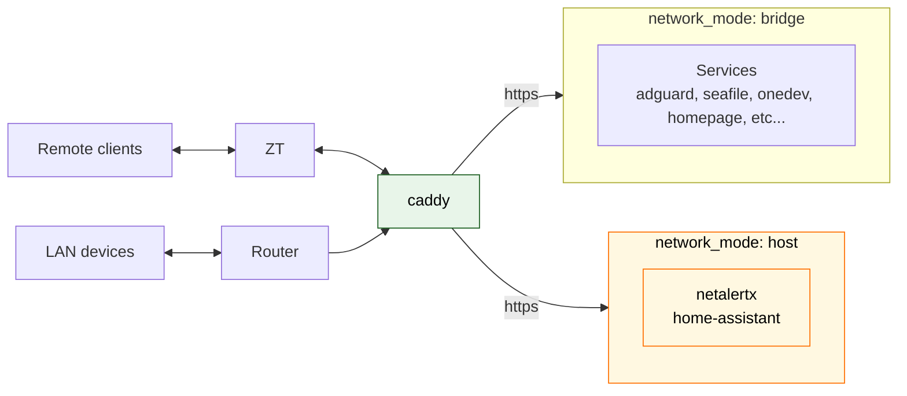

# Flat Lab

Single-node home lab on a Raspberry Pi 5: one ZeroTier UDP port in, Caddy in front of everything else, self-hosted services on a bridge network.

## Topology

## Docs

- [`docs/architecture-notes.md`](docs/architecture-notes.md) — topology, long form