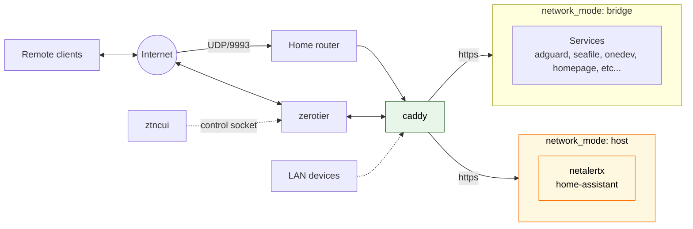

# Aspire Flat Lab

Single-node home lab on a Raspberry Pi 5: one ZeroTier UDP port in, Caddy in front of everything else, self-hosted services on a bridge network.

## Topology



One open port on the router, one HTTP edge on the Pi, one bridge network for almost everything.

## Run

On the server (fresh host or any later update), one command:

```bash
./deploy.sh --bootstrap   # first time: installs Docker, .NET 10, log2ram
./deploy.sh --pull        # every update after that
```

It creates `.env` from `.env.example` (generating what it can and asking for the rest), brings up the infra layer (`docker-compose.yml`) and installs the app layer (Aspire AppHost) as the `flat-lab` systemd service with the dashboard at `dashboard.<domain>`.

## Docs

- [`docs/architecture-notes.md`](docs/architecture-notes.md) — topology, long form